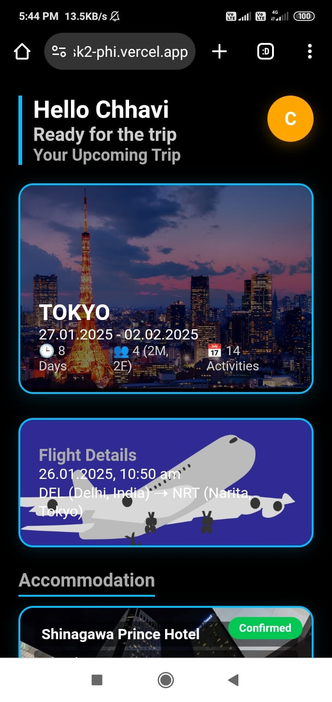

# ✈️ Tokyo Trip Dashboard - Assignment Task 2

This project is a **beautiful and responsive travel dashboard** built using React. It presents the complete itinerary of a Tokyo trip, including flight details, hotel accommodations, and scheduled activities—all styled with elegant black and blue themes and interactive UI elements.

## 🖼️ Screenshot



> 💡 **Live Demo**: [View Live on Vercel](https://assignment-task2-phi.vercel.app/)

## 🚀 Features

- 👋 Personalized welcome section
- 🗺️ Trip overview card with background image
- 🛫 Flight details with styled card
- 🏨 Hotel accommodation cards (Confirmed & Pending)
- 📅 Activity section with date-wise itinerary
- 🌗 Theme toggle button (C button) to switch between light and dark mode
- ✨ Beautiful UI with custom fonts, shadows, and hover effects

## 🛠️ Built With

- React.js
- HTML5 & CSS3
- Vite (or CRA)
- JavaScript
- APi integration 
- Vercel (for deployment)

## 📁 Project Structure

├── public/
├── src/
│ ├── App.css
│ ├── Dashboard.jsx
│ ├── index.js
│ └── assets/
│ ├── tokyo-trip.png
│ ├── image.png
│ ├── hotel.png
│ ├── image1.png ... image5.png
│ └── Dashboard.jpeg


## 📦 Setup Instructions

```bash
git clone https://github.com/Ashish20cs17/Assignment_task2.git
cd Assignment_task2
npm install
npm start
